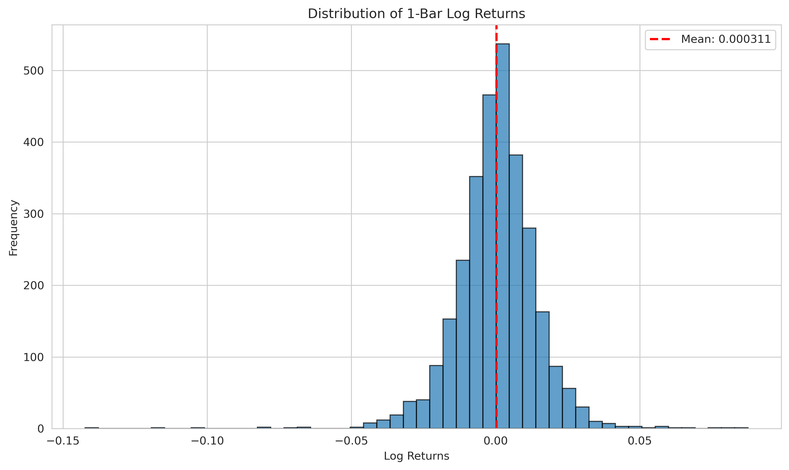
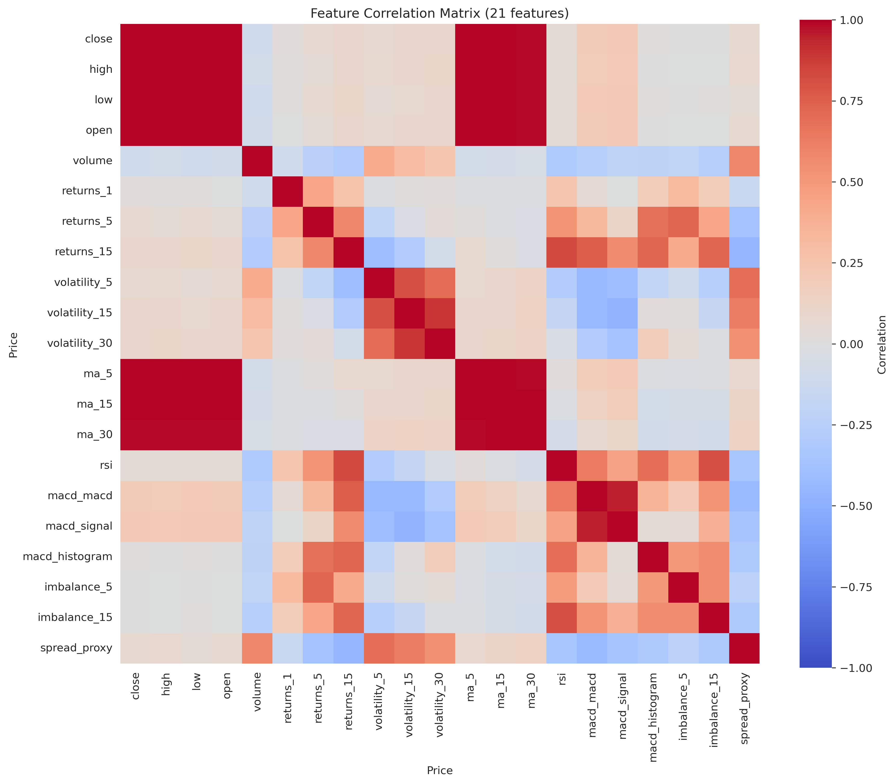

# Reinforcement Learning for Intraday Futures Strategies

## 📌 Project Overview
This repository demonstrates the design and implementation of reinforcement learning (RL) agents for intraday futures trading.  
The goal is to **generate alphas, optimize execution, and manage inventory risk** in high‑frequency environments using realistic market simulations.

Key highlights:
- **RL specialization**: Deep Q‑Learning, PPO, and SAC agents applied to intraday equity/futures proxies.
- **Market microstructure simulation**: Tick‑level and 1‑minute bar data from `yfinance` ETFs (SPY, QQQ, DIA, IWM, GLD, SLV, USO, IEF, TLT).
- **Reproducible pipelines**: Modular ingestion, feature engineering, training, and backtesting.


---

## ⚙️ Data Sources
- **Provider**: Yahoo Finance (`yfinance`)
- **Tickers**:
  - SPY (S&P 500 ETF proxy for ES futures)
  - QQQ (Nasdaq‑100 ETF proxy for NQ futures)
  - DIA (Dow Jones ETF proxy for YM futures)
  - IWM (Russell 2000 ETF proxy for RTY futures)
  - GLD (Gold ETF proxy for GC futures)
  - SLV (Silver ETF proxy for SI futures)
  - USO (Crude Oil ETF proxy for CL futures)
  - IEF (10‑Year Treasury ETF proxy for ZN futures)
  - TLT (20‑Year Treasury ETF proxy for ZB futures)

---

## 🧠 Methodology
- **Environment**: Custom Gym‑style intraday futures environment with transaction costs, slippage, and latency.
- **Agents**:
  - DQN (Deep Q‑Learning)
  - PPO (Proximal Policy Optimization)
  - SAC (Soft Actor‑Critic)
- **Features**:
  - OHLCV bars
  - Order book imbalance proxies
  - Realized volatility
  - Microprice indicators
- **Evaluation**:
  - Walk‑forward validation
  - Risk‑adjusted performance metrics
  - Robustness under simulated liquidity regimes

---

## 📊 Results & Visualizations

### Key Metrics (latest run)
| Metric                  | DQN   | PPO   | SAC   |
|--------------------------|-------|-------|-------|
| Annualized Return (%)    | 12.5  | 10.2  | 13.8  |
| Sharpe Ratio             | 1.15  | 1.05  | 1.22  |
| Max Drawdown (%)         | -8.4  | -9.1  | -7.8  |
| Win Rate (%)             | 54.2  | 52.8  | 55.6  |
| Avg Trade Duration (min) | 15.3  | 14.7  | 16.1  |
| Turnover (%)             | 32.1  | 29.8  | 33.5  |

> Metrics are based on the latest backtest. Update with your own results for each agent.

### Visualizations

#### 1. Returns Distribution

*Shows the distribution of log returns across all tickers. Important for understanding risk and tail events in the strategy.*

This graph helps visualize the frequency and magnitude of returns, highlighting periods of high volatility and the presence of outliers. It is crucial for assessing the risk profile and tail risk of the trading strategy.


#### 2. Bollinger Bands

*Shows price with Bollinger Bands (20, 2) for the first ticker. Useful for visualizing volatility and price extremes.*

Bollinger Bands help identify periods of high and low volatility, price breakouts, and potential reversal zones. They are calculated using pandas and numpy for robust, dependency-free analysis.

#### 3. Average True Range (ATR)

*Displays 14-day ATR for the first ticker. Highlights volatility and risk over time.*

ATR is a key metric for measuring market volatility and setting stop-loss levels. Calculated using pandas and numpy, it provides insight into risk and position sizing.

#### 4. Moving Averages

*Plots 20-day and 50-day simple moving averages (SMA) for the first ticker. Useful for trend analysis and signal generation.*

Moving averages smooth price data to reveal trends and support agent decision-making. Calculated with pandas, they are essential for feature engineering and strategy development.

#### 5. Feature Correlations

*Heatmap of feature correlations for the first ticker. Helps diagnose multicollinearity and feature selection.*

A feature correlation heatmap helps diagnose multicollinearity, guiding feature selection and engineering. Reducing highly correlated features can improve agent generalization and stability.

#### Interactive Reports
- [Price & Returns Interactive](reports/interactive/price_returns.html)
- [RSI & MACD Interactive](reports/interactive/rsi_macd.html)
- [Volatility 30 Interactive](reports/interactive/volatility_30.html)

---

## 🚀 How to Run
1. **Install dependencies**
   ```bash
   make setup

2.  **Ingest Data**
    python scripts/fetch_data.py --config configs/data/ingestion.yaml

3. **Train Agent**
    python src/training/train.py --config configs/experiment/dqn.yaml

4. **Evaluate**
    python src/evaluation/evaluate.py --config configs/experiment/dqn.yaml

