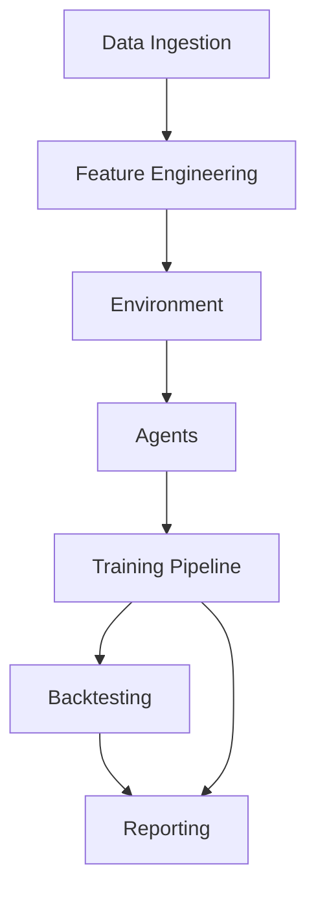

# Project Architecture Overview

This document describes the high-level architecture of the RL Intraday Futures Strategies project.

## Main Components

- **Data Ingestion**: Fetches raw financial data from Yahoo Finance and ArcticDB.
- **Feature Engineering**: Processes raw data into features for RL agents.
- **Environment**: Custom Gym-style environment simulating intraday futures trading, including transaction costs and slippage.
- **Agents**: RL agents (DQN, PPO, SAC) that interact with the environment and learn trading policies.
- **Training Pipeline**: Orchestrates agent training, logging, and experiment tracking (MLflow, TensorBoard).
- **Backtesting**: Evaluates agent performance on historical data.
- **Reporting**: Generates visualizations and interactive reports for analysis.

## Component Interactions

## Key Files & Folders
- `src/data/`: Ingestion and feature pipeline modules
- `src/envs/`: Environment and cost/reward modules
- `src/agents/`: RL agent implementations
- `src/training/`: Training loop and callbacks
- `src/sim/`: Market simulator
- `scripts/`: CLI wrappers for pipeline stages
- `reports/`: Output visualizations and interactive HTML
- `arch/`: Architecture docs and diagrams

---
For more details, see the code and README.
